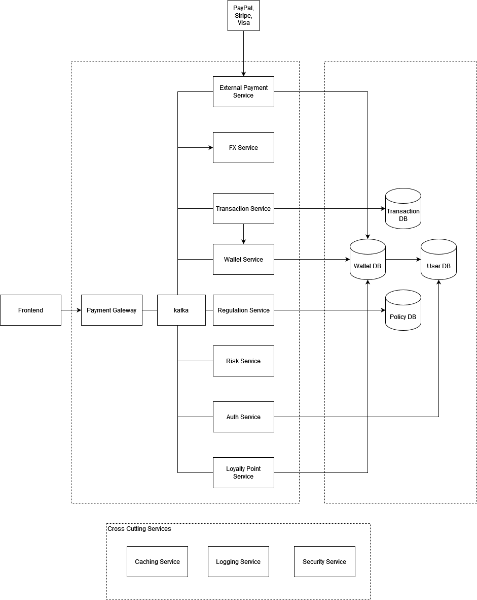
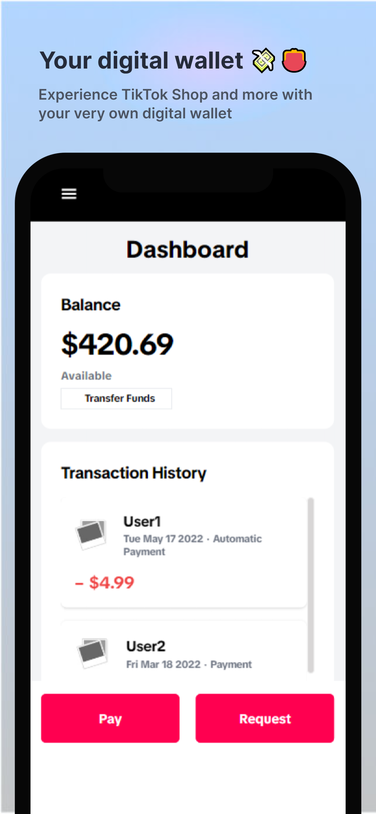
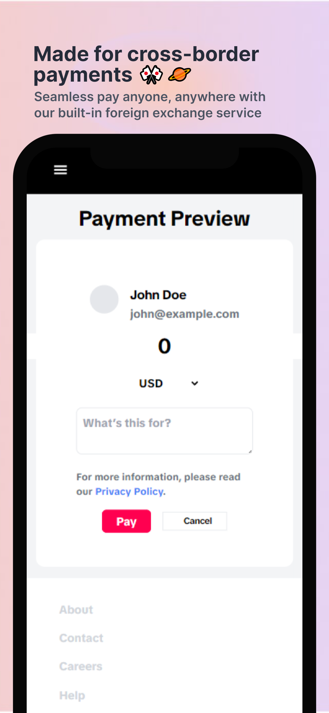
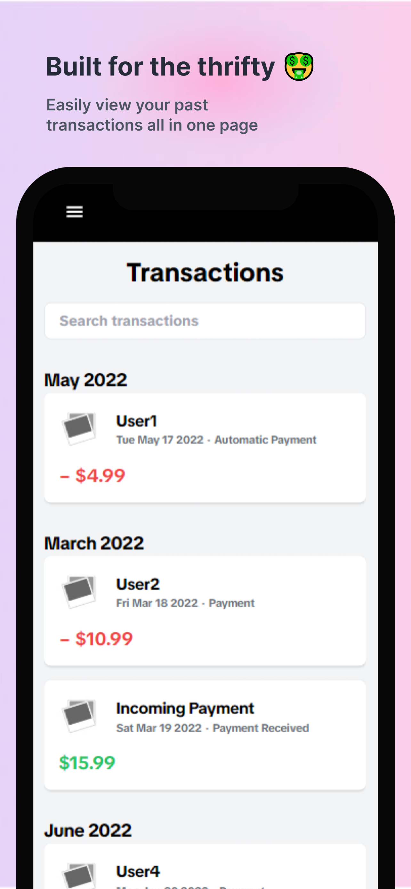
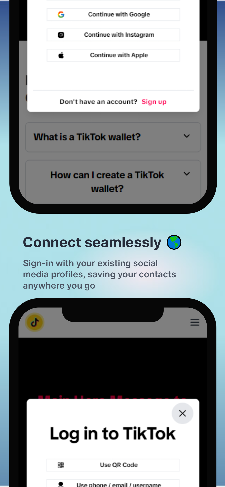
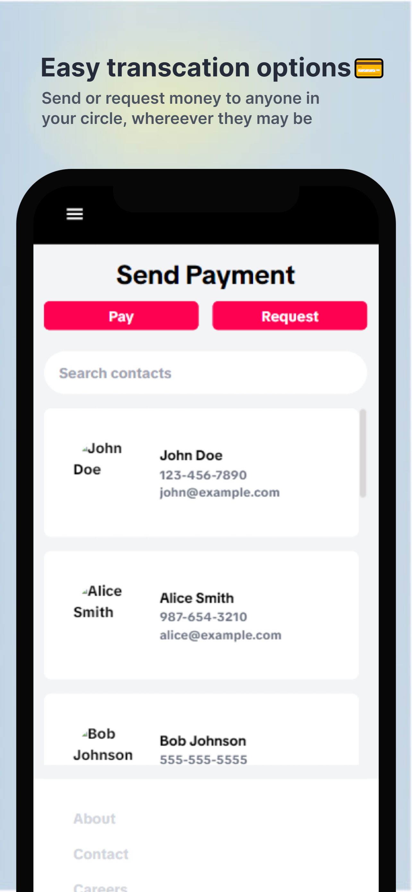

# Wallet as a Service
Wallet As A Service for TikTok Hackathon 2023

## Proposed Architecture



<div id="top"></div>
<!--
*** Thanks for checking out the Best-README-Template. If you have a suggestion
*** that would make this better, please fork the repo and create a pull request
*** or simply open an issue with the tag "enhancement".
*** Don't forget to give the project a star!
*** Thanks again! Now go create something AMAZING! :D
-->

<!-- PROJECT LOGO -->
<br />
<div align="center">
  <a href="https://github.com/yl-ang/waas">
    
  </a>

  <h3 align="center">WaaS</h3>

  <p align="center">
    Facillitaing payments for anyone, anywhere.
    <br />
    <a href="https://github.com/yl-ang/waas"><strong>Explore the docs »</strong></a>
    <br />
    <br />
    <a href="https://www.youtube.com/watch?v=tCh1siGGsVQ">View Video Demo</a>
    ·
    <a href="https://demo.com">Try Demo</a>
    ·
    <a href="mailto: waas@team.com">Report Bug</a>
  </p>
</div>

<!-- TABLE OF CONTENTS -->
<details>
  <summary>Table of Contents</summary>
  <ol>
    <li>
      <a href="#about-the-project">About The Project</a>
      <ul>
        <li><a href="#built-with">Built With</a></li>
      </ul>
    </li>
    <li>
      <a href="#getting-started">Getting Started</a>
      <ul>
        <li><a href="#prerequisites">Prerequisites</a></li>
        <li><a href="#installation">Installation</a></li>
      </ul>
    </li>
    <li><a href="#usage">Usage</a></li>
    <li><a href="#roadmap">Roadmap</a></li>
    <li><a href="#contact">Contact</a></li>
    <li><a href="#acknowledgements">Acknowledgements</a></li>
  </ol>
</details>

<!-- ABOUT THE PROJECT -->

## About The Project

<h3>Preview</h3>

<div style="overflow-x: auto; white-space: nowrap;">
  
  
  
  
  
</div>


<h3>Background</h3>

The inspiration behind our digital wallet service for TikTok stems from the vision of seamlessly integrating financial and transactional capabilities into the vibrant TikTok ecosystem. Drawing upon a comprehensive architecture that includes specialized components like WalletService, Frontend, Loyalty Service, FX Service for currency exchange, and a robust Transactions Service, we aim to empower TikTok users with a unified financial experience. Our inspiration is to enhance user engagement by allowing TikTok enthusiasts to effortlessly manage their finances, access loyalty rewards, and conduct transactions within the TikTok platform. This innovative approach reflects our commitment to providing users with a secure and convenient digital wallet solution, ensuring that TikTok remains not just a platform for entertainment but also a versatile and user-centric financial companion.


<p align="right">(<a href="#top">back to top</a>)</p>

<br />

### Built With

This section should list any major frameworks/libraries used to bootstrap your project. Leave any add-ons/plugins for the acknowledgements section. Here are a few examples.

- [![React][react.js]][react-url]
- [![Tailwind][tailwind]][tailwind-url]
- [![NextJS][nextjs]][nextjs-url]
- [![ExpressJS][expressjs]][expressjs-url]


<p align="right">(<a href="#top">back to top</a>)</p>

<!-- GETTING STARTED -->

## Getting Started

To get a local copy up and running follow these simple example steps.

### Prerequisites

This is an example of how to list things you need to use the software and how to install them.

- npm
  ```sh
  npm install npm@latest -g
  ```


### Installation

_Below is an example of how you can instruct your audience on installing and setting up your app. This template doesn't rely on any external dependencies or services._

1. Clone the repo
   ```sh
   git clone git@github.com:yl-ang/waas.git
   ```
2. Install NPM packages for each of the services
   ```sh
   npm install
   ```
3. If you want to try our a dev deployment for the frontend just run `npm run dev` to start the NextJS application.
4. If you need to build for production, just run `npm run build` to build a production ready application.

<p align="right">(<a href="#top">back to top</a>)</p>

<!-- USAGE EXAMPLES -->

## Usage

<h3>Dashboard</h3>

![Dashboard Screen Shot][dashboard-screenshot]

1. Run `npm run dev` to get it running locally.
2. After loggin in you will arrive at this page, this is where you view all your past payments, current balance at a glance.

![Activity Screen Shot][activity-screenshot]

3. This is where you keep track of your past transactions.
4. You can use the search module to view any transactions that you have seen.

![Payment Screen Shot][payment-screenshot]

5. This is where you can search for possible contacts to transact with.

![Preview Screen Shot][preview-screenshot]

6. Right before sending the transaction, you can input the amount, and the purpose of the transaction.
7. Hit Pay/Request to confirm the transaction!


<p align="right">(<a href="#top">back to top</a>)</p>

<!-- ROADMAP -->

## Roadmap


<p align="right">(<a href="#top">back to top</a>)</p>

<!-- CONTACT -->

## Contact

Bobby Ang- [Linkedin]()

Jason Yap - [Linkedin](https://www.linkedin.com/in/ja-sony/)

Dominic Lim - [LinkedIn]()

Jerome Wong - [LinkedIn]()


Project Link: [GitHub](https://github.com/yl-ang/waas)

<p align="right">(<a href="#top">back to top</a>)</p>

<!-- ACKNOWLEDGEMENTS --> 

## Acknowledgements
We made use of the following libraries in our application.

1. [tailwindcss](https://tailwindcss.com/)
2. [screenshots.pro](https://screenshots.pro/)
3. [react-icons](https://react-icons.github.io/react-icons)

<p align="right">(<a href="#top">back to top</a>)</p>

<!-- MARKDOWN LINKS & IMAGES -->
<!-- https://www.markdownguide.org/basic-syntax/#reference-style-links -->

[dashboard-screenshot]: ./frontend/public/dashboard.png
[activity-screenshot]: ./frontend/public/activity.png
[payment-screenshot]: ./frontend/public/payments.png
[preview-screenshot]: ./frontend/public/preview.png

[1-screenshot]: ./img/1.png
[2-screenshot]: ./img/2.png
[3-screenshot]: ./img/3.png
[4-screenshot]: ./img/4.png
[5-screenshot]: ./img/5.png


[react.js]: https://img.shields.io/badge/React-20232A?style=for-the-badge&logo=react&logoColor=61DAFB
[react-url]: https://reactjs.org/
[tailwind]: https://img.shields.io/badge/tailwindcss-%2338B2AC.svg?style=for-the-badge&logo=tailwind-css&logoColor=white
[tailwind-url]: https://tailwindcss.com/
[nextjs]: https://img.shields.io/badge/Next-black?style=for-the-badge&logo=next.js&logoColor=white
[nextjs-url]: https://nextjs.org/
[expressjs]: https://img.shields.io/badge/Express.js-404D59?style=for-the-badge
[expressjs-url]: https://expressjs.com/